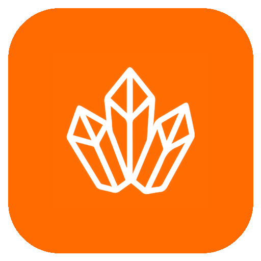

<div align="center">



#  Crystall Music

**Next-Gen Android Music Player with Pure Liquid Glassmorphism & Autonomous YouTube Music Engine**

[-black?style=for-the-badge&logo=android)](https://developer.android.com/)
[](https://developer.android.com/jetpack/compose)
[](https://developer.android.com/media/media3)
[](LICENSE)

[**English**](#-english) • [**Русский**](#-русский) • [**Türkçe**](#-türkçe) • [**한국어**](#-한국어)

</div>

---

<a name="english"></a>
## 🌐 English

### Overview
**Crystall Music** is a minimalist, serverless Android music player engineered with an authentic **Pure Liquid Glassmorphism (iOS / Apple Music)** aesthetic. It streams and downloads original, uncompressed audio directly from **YouTube Music** (AAC 128 kbps / itag 140) without third-party proxies, API keys, or subscriptions.

### ✨ Key Features
-  **Pure Liquid Glass Aesthetic**: Frosted acrylic surfaces, subtle 0.5dp specular highlights, iOS squircle artwork frames (32dp), and pitch-black OLED background with zero neon glare.
- 🏝️ **Floating Dynamic Island Mini-Player**: Detached glass capsule floating above navigation, equipped with live playback progress, spring physics controls, and instant dismiss (`X`).
- ⚡ **100% Serverless Streaming**: Directly resolves YouTube Music audio streams with automatic STS (Signature Timestamp) and dynamic visitor authentication.
- 💾 **One-Tap Offline Downloader**: Saves original tracks straight into device storage (`.m4a`/AAC) with live progress tracking (0–100%) and instant offline playback.
- 📊 **Crystal Soundwave Equalizer**: 4-bar reactive frosted glass waveform equalizer that dances rhythmically during playback and smoothly settles on pause.
- 📱 **Apple Music Full Player**: Instant expansion upon tapping any track, featuring volume/progress scrubbers, queue management with a dedicated "Stop & Clear" button, and fluid gestures.
- 📋 **Universal Playlist Importer**: Paste any YouTube Music playlist URL to import, preview, and download all tracks offline with a single click.

### 🛠 Tech Stack
- **Language**: Kotlin 2.0 (Coroutines, StateFlow, Flow)
- **UI Framework**: Jetpack Compose (Material 3, Spring Animations, AnimatedContent)
- **Audio Engine**: AndroidX Media3 ExoPlayer (`DefaultDataSource.Factory` for online & local files)
- **Networking**: OkHttp3 with custom browser/client headers
- **Image Loading**: Coil Compose (asynchronous cover caching)
- **Storage**: SQLite / Android SQLiteOpenHelper

### 🚀 Installation & Build
1. Clone the repository:
   ```bash
   git clone https://github.com/oladikezz/Crystall-Music.git
   cd Crystall-Music
   ```
2. Build debug APK using Gradle:
   ```bash
   ./gradlew assembleDebug
   ```
3. Locate APK: `app/build/outputs/apk/debug/app-debug.apk` or `CrystallMusic.apk`.

---

<a name="русский"></a>
## 🇷🇺 Русский

### Описание
**Crystall Music** — минималистичный бессерверный плеер для Android, спроектированный в строгом дизайне **Pure Liquid Glass (iOS / Apple Music)**. Приложение напрямую воспроизводит и скачивает оригинальные треки с **YouTube Music** (чистый AAC 128 kbps / itag 140) без сторонних серверов, рекламы и подписок.

### ✨ Основные возможности
-  **Дизайн Pure Liquid Glass**: Матовое полупрозрачное стекло, зеркальные грани `0.5.dp`, сквирклы обложек Apple (32.dp) и глубокий OLED-фон без раздражающего кислотного неона.
- 🏝️ **Парящий Dynamic Island Mini-Player**: Изолированная стеклянная капсула над панелью навигации с тонким индикатором прогресса, пружинными кнопками и крестиком закрытия (`X`).
- ⚡ **100% Автономный стриминг**: Мгновенный запуск оригинальных аудиопотоков YouTube Music с динамическим обходом ограничений через официальный JSON API.
- 📥 **Офлайн-скачивание в один клик**: Сохранение аудио в локальную память устройства (`.m4a`) с прогрессом от 0% до 100% и доступом в режиме полета.
- 📊 **Стеклянный эквалайзер**: Четыре живых кристально-белых столбика звуковой волны, танцующих в такт музыке.
- 📱 **Полноэкранный плеер Apple Music**: Мгновенно открывается при нажатии на любой трек, поддерживает свайп вниз, волновой скраббер и кнопку «Выключить» в очереди.
- 📋 **Импорт плейлистов**: Вставьте ссылку на плейлист из YouTube Music, чтобы сохранить его в свою медиатеку или скачать целиком.

### 🚀 Сборка проекта
```bash
git clone https://github.com/oladikezz/Crystall-Music.git
cd Crystall-Music
./gradlew assembleDebug
```
Готовый APK: `CrystallMusic.apk` в корне проекта.

---

<a name="türkçe"></a>
## 🇹🇷 Türkçe

### Genel Bakış
**Crystall Music**, minimalist ve sunucusuz bir Android müzik çalarıdır. Tamamen **Pure Liquid Glass (iOS / Apple Music)** estetiği ile tasarlanmıştır. Harici sunuculara, reklamlara veya aboneliklere ihtiyaç duymadan doğrudan **YouTube Music** üzerinden orijinal ses akışlarını (AAC 128 kbps / itag 140) çalar ve indirir.

### ✨ Temel Özellikler
-  **Saf Sıvı Cam (Liquid Glass) Tasarımı**: Mat akrilik yarı saydam yüzeyler, 0.5dp ayna parlaklığında kenarlıklar, Apple squircle albüm kapakları (32dp) ve göz yormayan saf siyah OLED arka plan (neon ışıltısız).
- 🏝️ **Yüzen Dynamic Island Mini Çalar**: Gezinme çubuğunun üzerinde asılı duran, pürüzsüz yay animasyonlu kontrollere ve hızlı kapatma (`X`) butonuna sahip cam kapsül.
- ⚡ **%100 Bağımsız Akış**: Resmi YouTube Music JSON API'si üzerinden STS ve oturum belirteçleri ile doğrudan ve kesintisiz akış.
- 📥 **Tek Dokunuşla Çevrimdışı İndirme**: Orijinal parçaları cihaz depolama alanına (`.m4a`) kaydeder; uçak modunda dahi sorunsuz çalışır.
- 📊 **Kristal Ses Dalgası Ekolayzırı**: Müziğin ritmine göre canlı ve akıcı hareket eden 4 çubuklu kristal beyaz dalga görselleştirici.
- 📱 **Gelişmiş Tam Ekran Çalar**: Herhangi bir parçaya dokunulduğunda anında açılır; dalga formu çubuğu ve çalma listesini tamamen durdurma butonu içerir.
- 📋 **Oynatma Listesi İçe Aktarma**: YouTube Music çalma listesi bağlantısını yapıştırarak tüm listeyi kütüphanenize kaydedin veya tek tıkla indirin.

### 🚀 Kurulum ve Derleme
```bash
git clone https://github.com/oladikezz/Crystall-Music.git
cd Crystall-Music
./gradlew assembleDebug
```
Derlenen APK dosyası: `CrystallMusic.apk`.

---

<a name="한국어"></a>
## 🇰🇷 한국어

### 개요
**Crystall Music**은 차세대 **퓨어 리퀴드 글래스모피즘(Pure Liquid Glass / iOS Apple Music)** 디자인을 적용한 미니멀하고 독립적인 오픈소스 안드로이드 음악 플레이어입니다. 외부 프록시 서버나 결제 구독 없이 **유튜브 뮤직(YouTube Music)**의 오리지널 고음질 오디오 스트림(AAC 128 kbps / itag 140)을 다이렉트로 재생하고 기기에 다운로드합니다.

### ✨ 주요 기능
-  **퓨어 리퀴드 글래스 디자인**: 반투명 프로스티드 아크릴 글래스, 0.5dp 세밀한 빛 반사 테두리, iOS 스쿼클(Squircle 32dp) 앨범 커버, 눈이 편안한 OLED 딥 블랙 테마 (네온 제거).
- 🏝️ **플로팅 다이내믹 아일랜드 미니 플레이어**: 하단 내비게이션 위에 부드럽게 떠 있는 글래스 캡슐 디자인, 프로그레스 바, 스프링 물리 애니메이션 및 즉각 닫기(`X`) 버튼 지원.
- ⚡ **100% 서버리스 다이렉트 스트리밍**: 공식 YouTube Music JSON API 프로토콜과 다이내믹 세션 인증을 통해 지연 및 끊김 없는 스트리밍.
- 📥 **원탭 오프라인 음원 다운로드**: 터치 한 번으로 디바이스 로컬 저장소에 고음질 음원(`.m4a`) 저장, 비행기 탑승 중에도 데이터 없이 감상 가능.
- 📊 **크리스탈 사운드 이퀄라이저**: 재생 중 부드럽게 움직이고 일시 정지 시 자연스럽게 가라앉는 4바(bar) 리얼타임 비주얼라이저.
- 📱 **애플 뮤직 스타일 풀 플레이어**: 트랙을 터치하면 즉시 부드럽게 열리는 전체화면 플레이어, 파형 탐색 및 대기열 원터치 '종료/끄기' 기능 제공.
- 📋 **플레이리스트 간편 가져오기**: 유튜브 뮤직 플레이리스트 링크를 붙여넣기만 하면 전체 곡을 보관함에 저장하거나 일괄 다운로드 가능.

### 🚀 빌드 및 실행
```bash
git clone https://github.com/oladikezz/Crystall-Music.git
cd Crystall-Music
./gradlew assembleDebug
```
생성된 설치 파일: 루트 폴더의 `CrystallMusic.apk`.

---

<div align="center">
Made with  aesthetics for pure musical enjoyment.
</div>